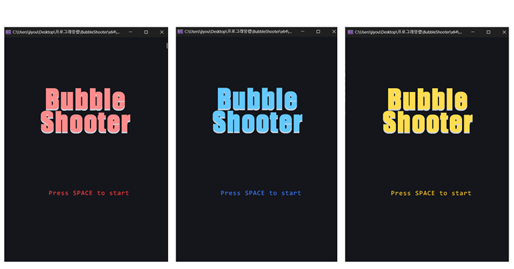
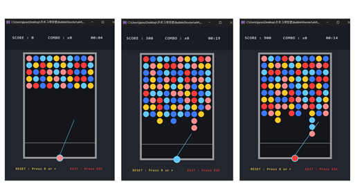
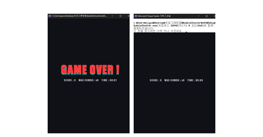

# BubbleShooter

> **조준하고, 튕기고, 맞추고!**
> *BubbleShooter*는 **싱글 플레이어** 버블 슈터로, **타이밍형 줄 추가**, **벽 반사(bank shot)**, **매치-3 제거**, **콤보 점수**, **떠 있는 군집 자동 낙하**를 핵심 재미로 삼습니다.

---

## 📌 개요

* **완성도**: \~95%
* **코드 라인 수**: \~1,230 lines
* **실행 해상도**: **600 × 850**
* **플랫폼**: Windows (Win32 GDI)
* **입력**: 마우스(조준), `Space` 발사 / `R` 리셋 / `ESC` 종료

---

## 🎮 핵심 특징

1. **싱글 플레이 버블 슈터**
   상단의 모든 버블을 제거하고 **최대한 높은 점수**를 노립니다.

2. **실시간 줄 추가(Deadline)**

   * 시작 시 **상단 5줄** 생성
   * 이후 **5초 간격**으로 **1줄**씩 추가(최대 **13줄**)
   * 버블이 \*\*데드라인(y 임계선)\*\*을 넘으면 **게임 종료**

3. **조준/발사 & 벽 반사**

   * 마우스로 조준, `Space`로 발사
   * 조준선은 **상단 방향 한정**(안전 보정)
   * 발사체는 **좌우 벽 반사** 후 기존 버블과 **충돌 시 정착**

4. **매치-3 제거 & 콤보**

   * **동일 색 3개 이상 인접**하면 자동 제거
   * 제거 후 **천장과 연결되지 않은 군집**은 자동 낙하 → **연쇄 쾌감**
   * **콤보**: **3초 내 연속 제거** 시 콤보 증가
   * **점수**: `제거 버블 수 × 100 × 콤보 배수`

5. **다음 슈팅 버블 미리보기 & 색상 제한(6종)**

   * 하단 중앙에 **다음 발사 버블** 미리 표시
   * 사용 색상:

     * Coral Red `RGB(255, 60, 60)`
     * Royal Blue `RGB(60, 120, 255)`
     * Golden Yellow `RGB(255, 200, 40)`
     * Light Red `RGB(255, 140, 140)`
     * Light Blue `RGB(100, 200, 255)`
     * Light Yellow `RGB(255, 220, 80)`

6. **HUD(상단 메뉴바)**
   **SCORE / COMBO / TIME** 실시간 표시(가독성 있는 폰트/정렬)

7. **시작/종료 화면**

   * 시작: 컬러 애니메이션 타이틀 + “**Press SPACE to start**” 깜빡임
   * 종료: **GAME OVER** 애니메이션 + **총점/최대 콤보/생존 시간** 요약

8. **더블 버퍼링으로 깜빡임 제거**
   모든 그리기는 **메모리 DC**에 먼저 수행 → `BitBlt()`로 일괄 복사

---

## 🕹 조작법

| 동작 | 키/마우스   | 설명                |
| -- | ------- | ----------------- |
| 조준 | 마우스 이동  | 조준선 표시(상단 방향 한정)  |
| 발사 | `Space` | 현재 조준 방향으로 버블 발사  |
| 리셋 | `R`     | 초기 상태(상단 5줄)로 재시작 |
| 종료 | `ESC`   | 종료 화면으로 전환        |

---

## 🧠 규칙 & 스코어링 요약

* **줄 추가 주기**: 5초
* **최대 줄 수**: 13줄
* **매치 조건**: 동일 색 **3개 이상 인접**
* **콤보 유효 시간**: **3초**
* **점수 공식**: `버블 수 × 100 × 콤보 배수`

---

## 실행 화면

1. 시작 화면

2. 게임 진행 화면
    

3. 종료 화면
    

---

## 🏗 빌드 & 실행

> ※ 저장소/솔루션 구조에 따라 달라질 수 있습니다. 실제 프로젝트에 맞춰 경로/설정을 조정하세요.

### 요구 사항

* Windows 10/11
* Visual Studio 2022 (C++17 이상)
* Win32 GDI(x64 빌드 지원)
* Windows 11 콘솔: 설정 → 기본 터미널 응용 프로그램을 Windows 콘솔 호스트로 변경(Windows 10 스타일 유지)
* kbhit(), getch() 사용 시: 프로젝트 속성 → SDL 검사를 아니요로 설정

### 실행

* 빌드 출력 실행 파일 더블클릭
* 창 크기: **600 × 850** 고정

---

## ⚙️ 기술 메모

* **좌표 체계 & 정렬**: 배열 기반 렌더링 ↔ GDI 좌표 일치, 중앙 기준 발사 좌표 정밀 계산
* **라인 푸시**: `pushNewLine()`로 상단 줄 추가/밀기 구현
* **충돌/정착**: 벽 반사 및 충돌 시 인접 빈 칸 스냅, **연결성 검사**로 부유 군집 낙하 처리
* **플리커 제거**: 메모리 DC → `BitBlt()` **더블 버퍼링**으로 잔상/깜빡임 제거

---

## 🚧 Roadmap

* 버블 **그라데이션/광택** 렌더링
* **사운드 이펙트/BGM** 추가
* **난이도/설정 메뉴**(줄 추가 주기, 색상 수, 속도 등)
* **스테이지/미션 모드**
* **코드 정리**(단일 책임·모듈화)
* **CI 빌드/릴리즈** 자동화

---

### 한 줄 소개

> **싱글 플레이 버블 슈터** — 5초마다 줄이 올라오고, 벽에 튕겨 맞추면 **매치-3**와 **콤보**로 점수가 폭발합니다. **더블 버퍼링**으로 매끄럽습니다.
